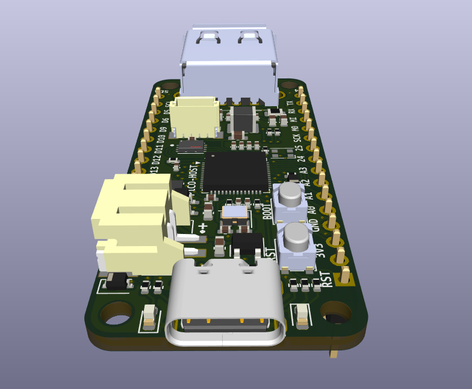

# PICO HOST #
RP2040 board inspired by [Adafruit's RP2040 Feather Host](https://learn.adafruit.com/adafruit-feather-rp2040-with-usb-type-a-host). Board features:
* JST XH Li-ion/Li-po battery connector.
* Battery charger circuit.
* USB A Female connector for [PIO based USB](https://github.com/sekigon-gonnoc/Pico-PIO-USB).
* Adafruit's `STEMMA QT` I2C connector.

